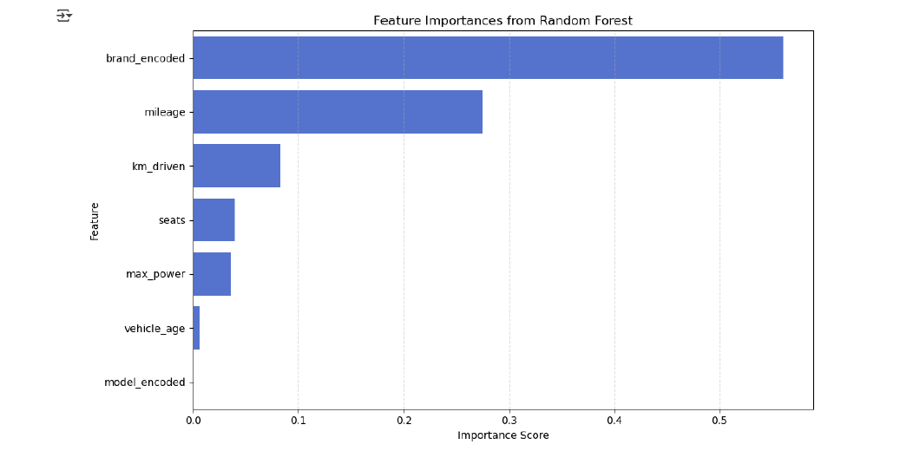
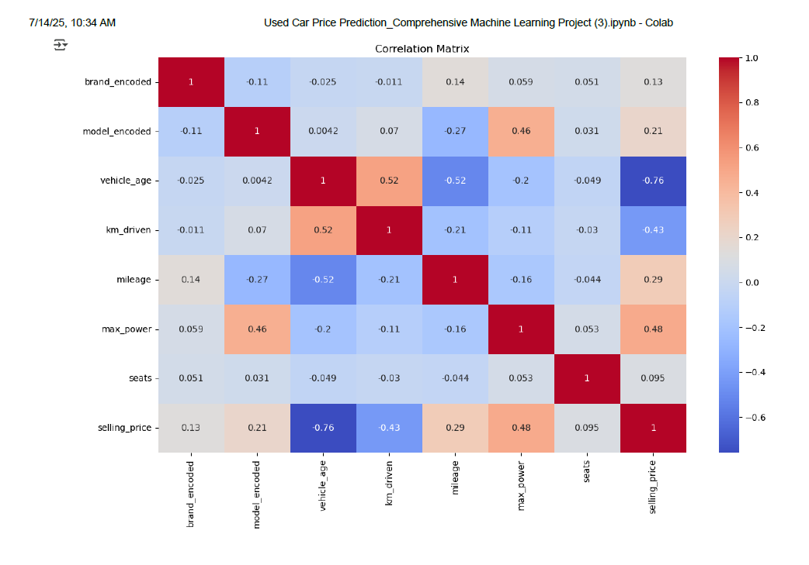
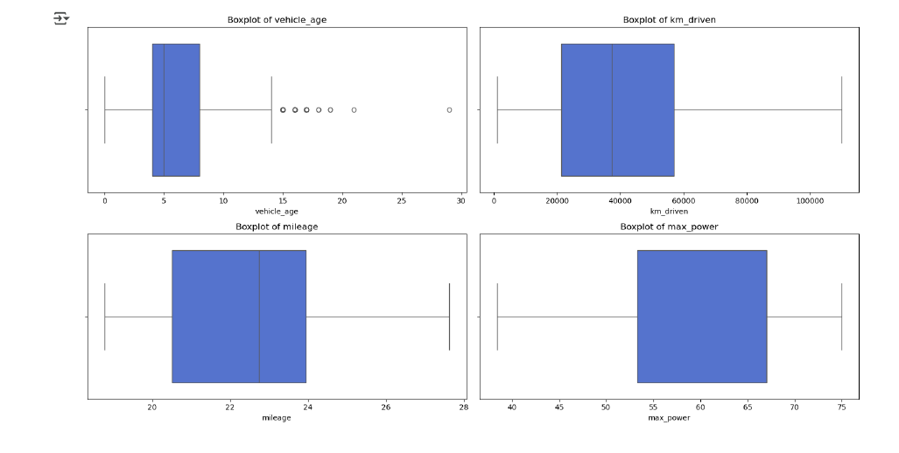
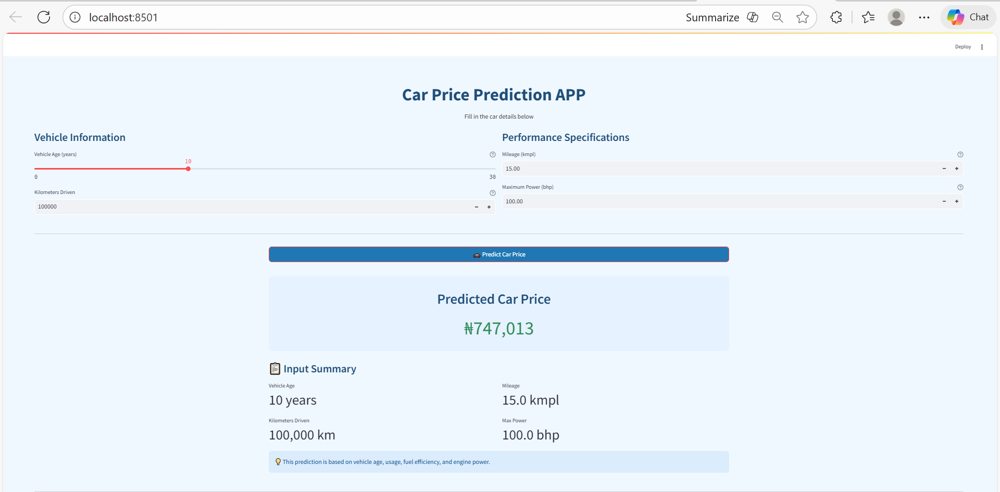

<p align="center">
  
</p>

# 🚗 End-to-End Used Car Price Prediction on AWS


## 📌 Project Overview

This project is an end-to-end Machine Learning application that predicts the selling price of used cars based on vehicle characteristics. It demonstrates the complete machine learning workflow—from data preprocessing and exploratory data analysis (EDA) to model training, evaluation, deployment with Streamlit, and cloud hosting on AWS EC2.

The project was built to showcase practical Data Science and Machine Learning skills using Python and Scikit-learn.

---

## 🎯 Business Problem

Pricing used vehicles accurately is essential for dealerships, online marketplaces, and private sellers. Manual pricing is often subjective and inconsistent.

This application predicts the estimated selling price of a used vehicle based on key vehicle attributes, helping users make data-driven pricing decisions.

---

## 🎯 Project Objective

The objective of this project is to develop a machine learning regression model capable of predicting used car selling prices based on vehicle specifications.

The solution provides:

- Accurate price estimation
- Data-driven pricing insights
- A user-friendly prediction interface through Streamlit
- A deployable machine learning application

---

# 🛠️ Technology Stack

| Category | Technology |
|-----------|------------|
| Programming Language | Python |
| Data Analysis | Pandas, NumPy |
| Data Visualization | Matplotlib |
| Machine Learning | Scikit-learn |
| Model | Random Forest Regressor |
| Web Application | Streamlit |
| Cloud Platform | AWS EC2 |
| Model Persistence | Joblib |
| Version Control | Git & GitHub |

---

# 📂 Dataset

The dataset contains information about used vehicles including:

- Brand
- Model
- Vehicle Age
- Kilometers Driven
- Mileage
- Maximum Power
- Number of Seats
- Selling Price (Target Variable)

---

# 🔍 Features Used for Model Training

- Brand
- Model
- Vehicle Age
- Kilometers Driven
- Mileage
- Maximum Power
- Seats

Target Variable:

- Selling Price (₦)

---

# ⚙️ Machine Learning Workflow

✔ Data Cleaning

✔ Exploratory Data Analysis (EDA)

✔ Feature Engineering

✔ Train/Test Split

✔ Model Training

✔ Model Evaluation

✔ Model Serialization using Joblib

✔ Streamlit Web Application

✔ AWS EC2 Deployment

---

## 🤖 Models Evaluated

- Linear Regression
- Decision Tree Regressor
- Random Forest Regressor

After evaluating the models, the **Random Forest Regressor** was selected as the final model because it achieved the best predictive performance.

---

## 📊 Model Performance

The machine learning models were evaluated using the **R² (Coefficient of Determination)** metric on both training and test datasets to assess model performance and generalization ability.

| Model | Train R² Score | Test R² Score |
|--------|---------------:|--------------:|
| Linear Regression | 0.77 | 0.70 |
| Decision Tree Regressor | 0.99 | 0.79 |
| Random Forest Regressor | 0.98 | **0.89** |


### 🎯 Key Result

- **Best Performing Model:** Random Forest Regressor
- **Train R² Score:** 0.98
- **Test R² Score:** **0.89**

The Random Forest model achieved the highest test performance, explaining approximately **89% of the variance** in used car prices on unseen data.

Although Decision Tree achieved a higher training score, Random Forest demonstrated better generalization and was selected as the final model for deployment.

---

# 📊 Exploratory Data Analysis

## Feature Importance

<p align="center">

</p>

---

## Correlation Heatmap

<p align="center">

</p>

---

## Outlier Detection

<p align="center">

</p>

---

# 💻 Streamlit Web Application

The application allows users to enter vehicle information and instantly receive a predicted selling price.

<p align="center">

</p>

---

# ☁️ AWS EC2 Deployment

The Streamlit application was successfully deployed on **Amazon Web Services (AWS EC2)** during development.

Deployment included:

- Launching an EC2 instance
- Installing project dependencies
- Running the Streamlit application
- Hosting the application through a public IP address

> **Note:** The live deployment is currently unavailable because the AWS Free Tier account has expired. The complete source code remains available in this repository and can be redeployed.
---

# 🏗️ Deployment Architecture

The application follows an end-to-end machine learning deployment workflow:

User Input
     ↓
Streamlit App
     ↓
Model (.pkl)
     ↓
Prediction
     ↓
AWS EC2

The deployed solution connects the trained machine learning model with a user-friendly Streamlit interface. Users can enter vehicle details, and the application processes the input through the trained Random Forest model to generate an estimated selling price.

---

# 📁 Project Structure

```text
end-to-end-car-price-prediction-aws/
│
├── images/
│   ├── banner.png                  # Project banner
│   ├── streamlit_app.png            # Application screenshot
│   ├── feature_importance.png       # Feature importance visualization
│   ├── correlation_heatmap.png      # Correlation analysis
│   └── outlier_boxplots.png         # Outlier detection plots
│
├── car_data_v2.csv                  # Used car dataset
├── car_price.pkl                    # Trained Random Forest model
├── car_price_app.py                 # Streamlit prediction application
├── train_app.py                     # Model training script
├── requirements.txt                 # Python dependencies
└── README.md                        # Project documentation

```

# 🚀 Installation

Clone the repository

```bash
git clone https://github.com/Blissfulebby/end-to-end-car-price-prediction-aws.git
```

Install dependencies

```bash
pip install -r requirements.txt
```

Run the Streamlit application

```bash
streamlit run car_price_app.py

---

# 📈 Skills Demonstrated

- Data Cleaning
- Exploratory Data Analysis
- Feature Engineering
- Machine Learning
- Model Evaluation
- Random Forest Regression
- Streamlit
- AWS EC2 Deployment
- Git & GitHub
- Python Programming

---

# 🚀 Future Improvements

# 🚀 Future Improvements

Potential future enhancements include:

- Containerize the application using Docker
- Implement CI/CD pipeline using GitHub Actions
- Track machine learning experiments using MLflow
- Add model monitoring and performance tracking
- Deploy using scalable AWS services such as Elastic Beanstalk or ECS
- Experiment with advanced machine learning models such as XGBoost and LightGBM

---

# 👩🏽‍💻 Author

**Agatha Onwudiwe**

**Data Scientist | Data Analyst**

📧 Email: agatha.onwudiwe@gmail.com

💼 LinkedIn: https://www.linkedin.com/in/agatha-onwudiwe-86b87215b

🌐 Portfolio: https://blissfulebby.github.io/AggiePortfolio

GitHub: https://github.com/Blissfulebby

---

## ⭐ If you found this project helpful, please consider giving it a star!
